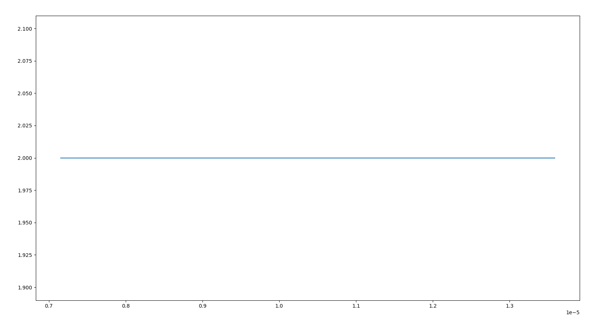
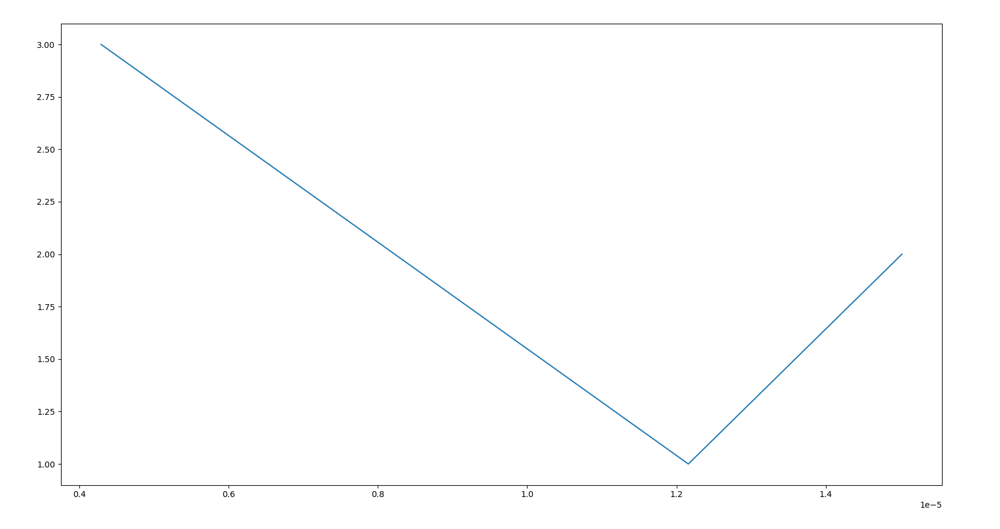
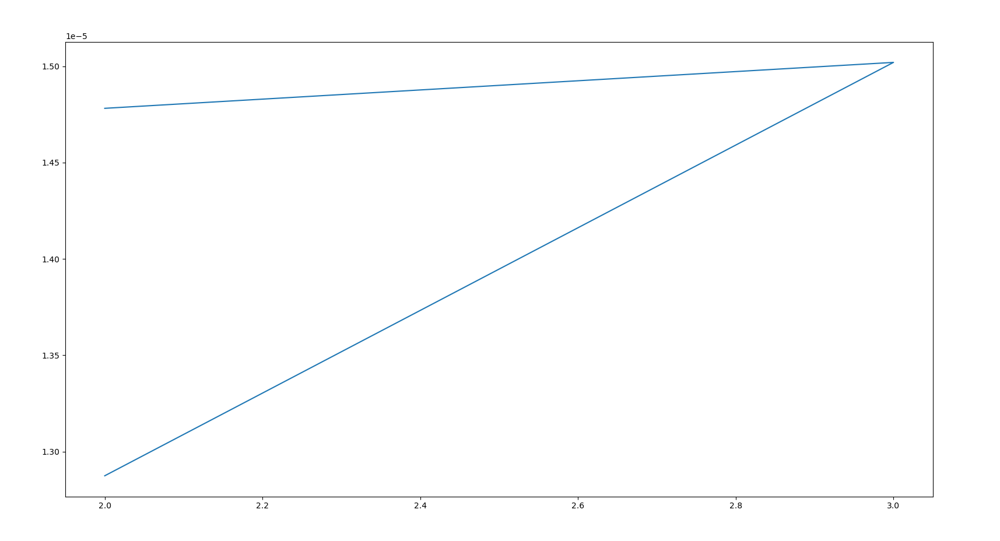
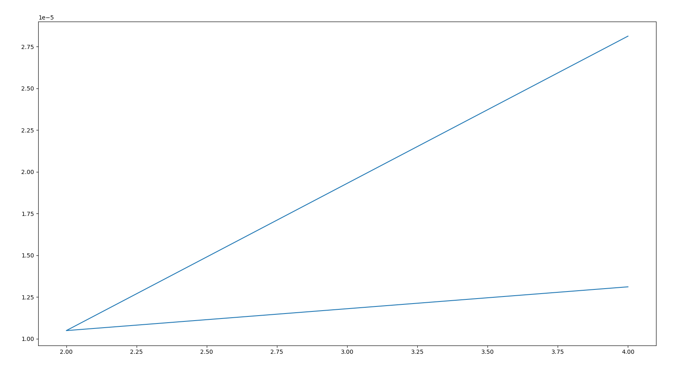
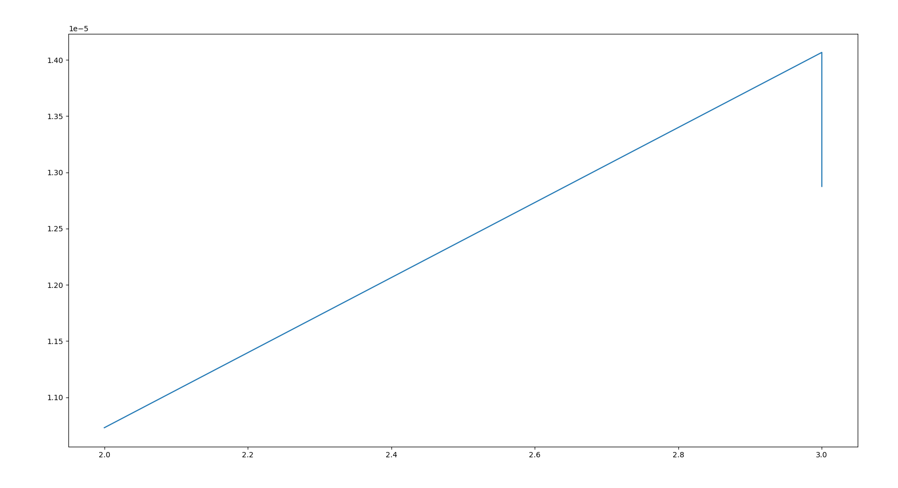
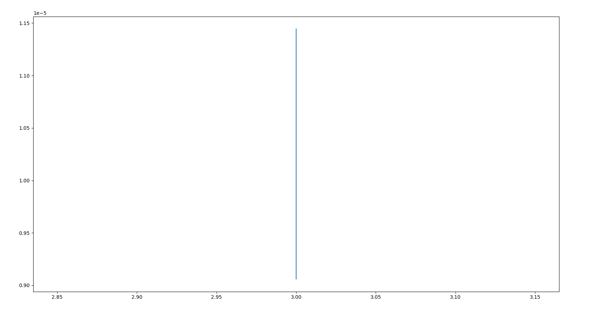

# CS3401 Algorithms

## 1. Implement Linear Search. Determine the time required to search for an element. Repeat the experiment for different values of n, the number of elements in the list to be searched and plot a graph of the time taken versus n.

`$ python3 1_linear_search.py`

OUTPUT:

```
Enter no of Execution: 3
Enter  n: 2
Enter Element : 1
Enter Element : 2
Enter key : 3
The list is  [1, 2]
Element not found!
Enter  n: 2
Enter Element : 1
Enter Element : 2
Enter key : 3
The list is  [1, 2]
Element not found!
Enter  n: 2
Enter Element : 1
Enter Element : 2
Enter key : 1
The list is  [1, 2]
Element found at index  1
Execution Time  [7.152557373046875e-06, 1.3589859008789062e-05, 7.3909759521484375e-06]

```




## 2. Implement recursive Binary Search. Determine the time required to search an element. Repeat the experiment for different values of n, the number of elements in the list to be searched and plot a graph of the time taken versus n.

`$ python3 2_binary_search.py`

OUTPUT:

```
Enter number of executions: 3
Enter n: 2
Enter element: 1
Enter element: 2
Enter key: 2
The list is:
1
2
Element found at index 1
Execution time: [1.5020370483398438e-05]
Enter n: 1
Enter element: 3
Enter key: 4
The list is:
3
Element not found!
Execution time: [1.5020370483398438e-05, 1.2159347534179688e-05]
Enter n: 3
Enter element: 2
Enter element: 1
Enter element: 4
Enter key: 1
The list is:
2
1
4
Element found at index 1
Execution time: [1.5020370483398438e-05, 1.2159347534179688e-05, 4.291534423828125e-06]
```



## 3. Given a text txt [0...n-1] and a pattern pat [0...m-1], write a function search (char pat [ ], char txt [ ]) that prints all occurrences of pat [ ] in txt [ ]. You may assume that n > m.

`$ python3 3_pattern_search.py`

OUTPUT:

```
Enter the number of texts: 3
Enter text element: abcdefghijklmnopqrstuvwxyz
Enter text element: foobarbaz
Enter text element: hello world

Enter the number of patterns: 2
Enter pattern element: bar
Enter pattern element: world

Pattern found at index 3
Pattern found at index 11
```

## 4.a. Sort a given set of elements using the Insertion sort methods and determine the time required to sort the elements. Repeat the experiment for different values of n, number of elements in the list to be sorted and plot a graph of the time take versus

`$ python3 4a_insertion_sort.py`

OUTPUT:

```
Enter the number of executions: 3
Enter n: 2
Enter element: 3
Enter element: 2
Sorted array is: [2, 3]
Execution Time: [1.2874603271484375e-05]
Enter n: 3
Enter element: 2
Enter element: 4
Enter element: 5
Sorted array is: [2, 4, 5]
Execution Time: [1.2874603271484375e-05, 1.5020370483398438e-05]
Enter n: 2
Enter element: 3
Enter element: 4
Sorted array is: [3, 4]
Execution Time: [1.2874603271484375e-05, 1.5020370483398438e-05, 1.4781951904296875e-05]
```



## 4.b Sort a given set of elements using the Heap sort methods and determine the time required to sort the elements. Repeat the experiment for different values of n, the number of elements in the list to be sorted and plot a graph of the time taken versus n

`$ python3 4b_heap_sort.py`

OUTPUT:
```
Enter the number of executions: 3
Enter n: 4
Enter element: 2
Enter element: 2
Enter element: 1
Enter element: 4
Sorted array is: [1, 2, 2, 4]
Execution Time: [2.8133392333984375e-05]
Enter n: 2
Enter element: 3
Enter element: 1
Sorted array is: [1, 3]
Execution Time: [2.8133392333984375e-05, 1.049041748046875e-05]
Enter n: 4
Enter element: 23
Enter element: 43
Enter element: 1
Enter element: 4
Sorted array is: [1, 4, 23, 43]
Execution Time: [2.8133392333984375e-05, 1.049041748046875e-05, 1.3113021850585938e-05]
```



## 5. Develop a program to implement graph traversal using Breadth First Search

`$ python3 5_bfs.py`

OUTPUT:

```
Following is the Breadth-First Search
5 3 7 2 4 8
```

## 6. Develop a program to implement graph traversal using Depth First Search

`$ python3 6_dfs.py`

OUTPUT:

```
Following is the Depth-First Search
5
3
2
4
8
7
```

## 7. Find the minimum cost spanning tree of a given undirected graph using Prim’s algorithm.

`$ python3 7_prims_algo.py`

OUTPUT:
```
Edge : Weight

0-2:5
2-3:1
3-4:1
4-1:2
```

## 8. From a given vertex in a weighted connected graph, develop a program to find the shortest paths to other vertices using Dijkstra's algorithm

`$ python3 8_dijkstra_algo.py`

OUTPUT:

```
Distance of a from source vertex: 0
Distance of b from source vertex: 3
Distance of c from source vertex: 1
Distance of d from source vertex: 2
Distance of e from source vertex: 4
Distance of f from source vertex: 4
Distance of g from source vertex: 3
```

## 9. Implement Floyd’s algorithm for the All-Pairs- Shortest-Paths problem

`$ python3 9_floyd_algo.py`

OUTPUT:

```
[[0, 3, 7, 5], [2, 0, 6, 4], [3, 1, 0, 5], [5, 3, 2, 0]]
```

## 10. Compute the transitive closure of a given directed graph using Warshall's algorithm.

`$ python3 10_warshall_algo.py`

OUTPUT:

```
[[1, 1, 1, 1], [1, 1, 1, 1], [1, 1, 1, 1], [1, 1, 1, 1]]
```

## 11. Develop a program to find out the maximum and minimum numbers in a given list of n numbers using the divide and conquer technique.

`$ python3 11_max_min.py`

OUTPUT:

```
Minimum: 1
Maximum: 9
```

## 12.a. Implement Merge sort method to sort an array of elements and determine the time required to sort. Repeat the experiment for different values of n, the number of elements in the list to be sorted and plot a graph of the time taken versus n.

`$ python3 12a_merge_sort.py`

OUTPUT:

```
Enter the number of executions: 3
Enter n: 3
Enter Element: 12
Enter Element: 4
Enter Element: 22
The list is [12, 4, 22]

Sorted array is
4 12 22
Execution Time: 1.2874603271484375e-05
Enter n: 3
Enter Element: 23
Enter Element: 12
Enter Element: 12
The list is [23, 12, 12]

Sorted array is
12 12 23
Execution Time: 1.4066696166992188e-05
Enter n: 2
Enter Element: 3
Enter Element: 4
The list is [3, 4]

Sorted array is
3 4
Execution Time: 1.0728836059570312e-05

```



## 12.b. Implement Quick sort method to sort an array of elements and determine the time required to sort. Repeat the experiment for different values of n, the number of elements in the list to be sorted and plot a graph of the time taken versus n.

`$ python3 12b_quick_sort.py`

OUTPUT:
```
Enter the number of executions: 3
Enter n: 3
Enter Element: 2
Enter Element: 3
Enter Element: 1
The list is [2, 3, 1]
Sorted Array in Ascending Order:
[1, 2, 3]

Execution Time: 1.1444091796875e-05
Enter n: 3
Enter Element: 54
Enter Element: 23
Enter Element: 6
The list is [54, 23, 6]
Sorted Array in Ascending Order:
[6, 23, 54]

Execution Time: 9.298324584960938e-06
Enter n: 3
Enter Element: 45
Enter Element: 243
Enter Element: 23
The list is [45, 243, 23]
Sorted Array in Ascending Order:
[23, 45, 243]

Execution Time: 9.059906005859375e-06
```



## 13. Implement N Queens problem using Backtracking.

`$ python3 13_n_queens.py`

OUTPUT:

```
. . Q .
Q . . .
. . . Q
. Q . .
```

## 14. Implement any scheme to find the optimal solution for the Traveling Salesperson problem and then solve the same problem instance using any approximation algorithm and determine the error in the approximation.

`$ python3 14_salesperson.py`

OUTPUT:

```
80
```

## 15. Implement randomized algorithms for finding the kth smallest number.

`$ python3 15_kth_smallest.py`

OUTPUT:

```
Original list:
[1, 2, 4, 3, 5, 4, 6, 9, 2, 1]
kth smallest element in the said list, when k = 1
1
kth smallest element in the said list, when k = 2
1
kth smallest element in the said list, when k = 3
2
kth smallest element in the said list, when k = 4
2
kth smallest element in the said list, when k = 5
3
kth smallest element in the said list, when k = 6
4
kth smallest element in the said list, when k = 7
4
kth smallest element in the said list, when k = 8
5
kth smallest element in the said list, when k = 9
6
kth smallest element in the said list, when k = 10
9
```
