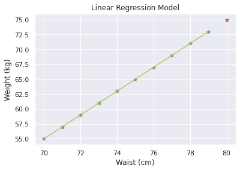
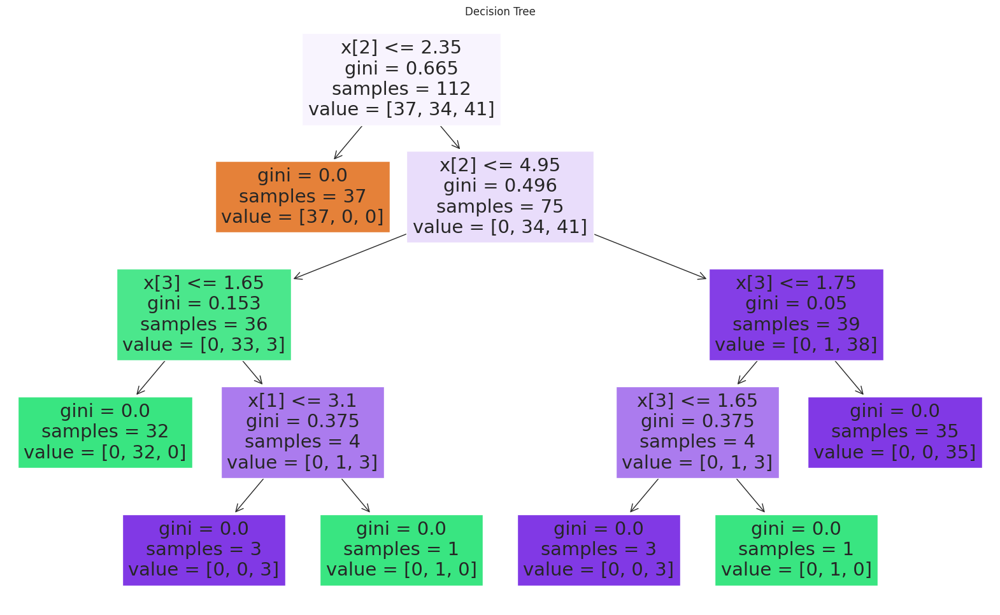
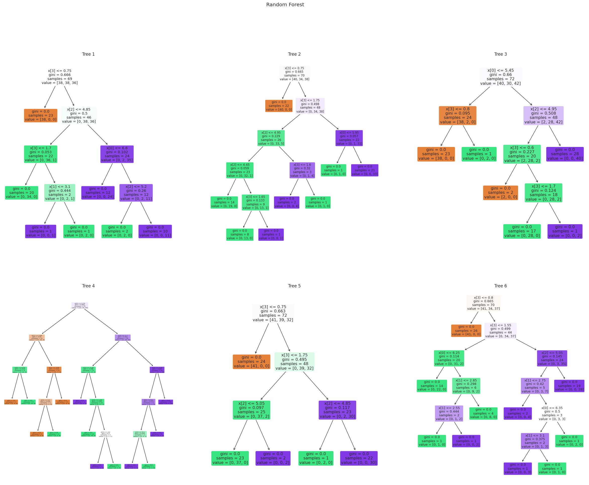
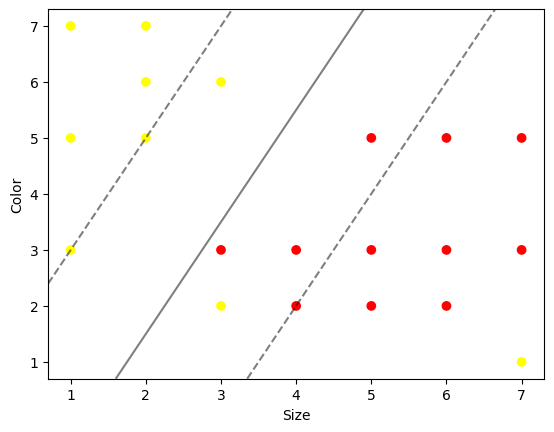
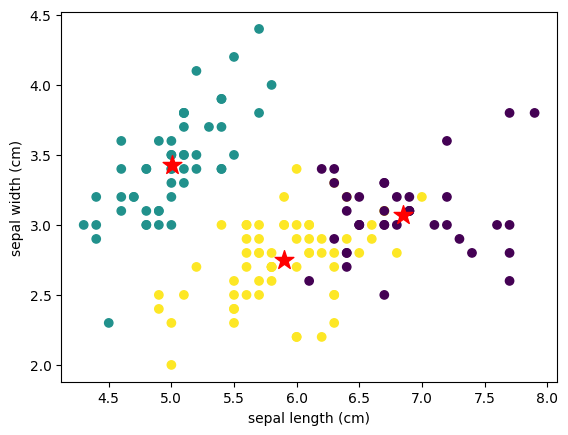

# CS3491 - ARTIFICIAL INTELLIGENCE AND MACHINE LEARNING

## 1.A UNINFORMED SEARCH ALGORITHM - BFS

`$ python3 1a_uninformed_search_algo_bfs.py`

OUTPUT:

```
The following is the breadth first search
5 3 7 2 4 8
```

## 1.B UNINFORMED SEARCH ALGORITHM - DFS

`$ python3 1b_uninformed_search_algo_dfs.py`

OUTPUT:

```
Following is the Depth First Search
5 3 2 4 8 7
```

## 2.A INFORMED SEARCH ALGORITHM A* SEARCH

`$ python3 2a_informed_search_algo_a_star.py`

OUTPUT:
```
['A', 'B', 'C', 'E']
```

## 2.B INFORMED SEARCH ALGORITHM MEMORY-BOUNDED A*

`$ python3 2b_informed_search_algo_mem_bound_a_star.py`

OUTPUT:

```
['A', 'B', 'C', 'D']
```

## 3. NAIVE BAYES MODEL

`$ python3 3_navie_bayes_model.py`

OUTPUT:
```
Accuracy : 1.0
Prediction:  [1]
```

## 4. BAYESIAN NETWORKS

`$ python3 4_bayesian_networks.py`

OUTPUT:

```
guesttAnprizet{
    "class" : "Distribution",
    "dtype" : "str",
    "name" : "DiscreteDistribution",
    "parameters" : [
        {
            "A" : 0.3333333333333333,
            "B" : 0.3333333333333333,
            "C" : 0.3333333333333333
        }
    ],
    "frozen" : false
}nmontyt{
    "class" : "Distribution",
    "dtype" : "str",
    "name" : "DiscreteDistribution",
    "parameters" : [
        {
            "A" : 0.0,
            "C" : 0.49999999999999983,
            "B" : 0.49999999999999983
        }
    ],
    "frozen" : false
}
guesttAnprizet{
    "class" : "Distribution",
    "dtype" : "str",
    "name" : "DiscreteDistribution",
    "parameters" : [
        {
            "A" : 0.3333333333333334,
            "B" : 0.0,
            "C" : 0.6666666666666664
        }
    ],
    "frozen" : false
}nmontytB

```

## 5. REGRESSION MODEL

`$ python3 5_regression_model.py`

OUTPUT:

```
Predicted weight for new waist value: 75
Mean Squared Error: 0.0
R-squared: 1.0
```



## 6. DECISION TREE AND RANDOM FOREST

`$ python3 6_decision_tree_and_random_forest.py`

OUTPUT:






```
Accuracy of decision tree: 0.97
Accuracy of random forest: 0.97
```

## 7. SVM MODELS

`$ python3 7_svm_models.py`

OUTPUT:



## 8.A ENSEMBLING TECHNIQUE BAGGING

`$ python3 8a_ensembling_technique_bagging.py`

OUTPUT:

```
0.030253774303769743
```

## 8.B ENSEMBLING TECHNIQUE BOOSTING

`$ python3 8b_ensembling_technique_boosting.py`

OUTPUT:

```
1.0
```

## 8.C ENSEMBLING TECHNIQUE STACKING

`$ python3 8c_ensembling_technique_stacking.py`

OUTPUT:
```
0.4
```

## 9 CLUSTERING ALGORITHM

`$ python3 9_clustering_algorithm.py`

OUTPUT:



## 10 EM FOR BAYESIAN NETWORKS

`$ python3 10_em_for_bayesian_networks.py`

OUTPUT:

```
Iteration 1...
Iteration 2...
Iteration 3...
Iteration 4...
Iteration 5...
Iteration 6...
Iteration 7...
Iteration 8...
Iteration 9...
Iteration 10...
Learned Parameters:
CPT for Burglary:
[0.5 0.5]

CPT for Earthquake:
[0.5 0.5]

CPT for Alarm given Burglary and Earthquake:
[[[0.00000000e+00 1.00000000e+00]
  [7.11149882e-04 9.99288850e-01]]

 [[0.00000000e+00 1.00000000e+00]
  [1.33911718e-03 9.98660883e-01]]]

CPT for JohnCalls given Alarm:
[[0.         1.        ]
 [0.13355124 0.86644876]]

CPT for MaryCalls given Alarm:
[[0.         1.        ]
 [0.13355124 0.86644876]]

```

## 11 BUILD SIMPLE NN MODEL

`$ python3 11_simple_nn_model.py`

OUTPUT:

```
Model: "sequential"
_________________________________________________________________
 Layer (type)                Output Shape              Param #   
=================================================================
 dense (Dense)               (None, 2)                 6         

 activation (Activation)     (None, 2)                 0         

 dense_1 (Dense)             (None, 1)                 3         

 activation_1 (Activation)   (None, 1)                 0         

=================================================================
Total params: 9
Trainable params: 9
Non-trainable params: 0
```

## 12 BUILD DEEP LEARNING NN MODELS

`$ python3 12_build_deep_learning_nn_models.py`

OUTPUT:
```
Downloading data from https://storage.googleapis.com/tensorflow/tf-keras-datasets/mnist.npz
11490434/11490434 [==============================] - 0s 0us/step
Epoch 1/5
1875/1875 [==============================] - 16s 8ms/step - loss: 0.2958 - accuracy: 0.9129
Epoch 2/5
1875/1875 [==============================] - 8s 4ms/step - loss: 0.1429 - accuracy: 0.9571
Epoch 3/5
1875/1875 [==============================] - 8s 4ms/step - loss: 0.1078 - accuracy: 0.9668
Epoch 4/5
1875/1875 [==============================] - 6s 3ms/step - loss: 0.0876 - accuracy: 0.9730
Epoch 5/5
1875/1875 [==============================] - 7s 4ms/step - loss: 0.0727 - accuracy: 0.9770
313/313 [==============================] - 1s 2ms/step - loss: 0.0759 - accuracy: 0.9759

[0.075935497879982, 0.9758999943733215]

```
